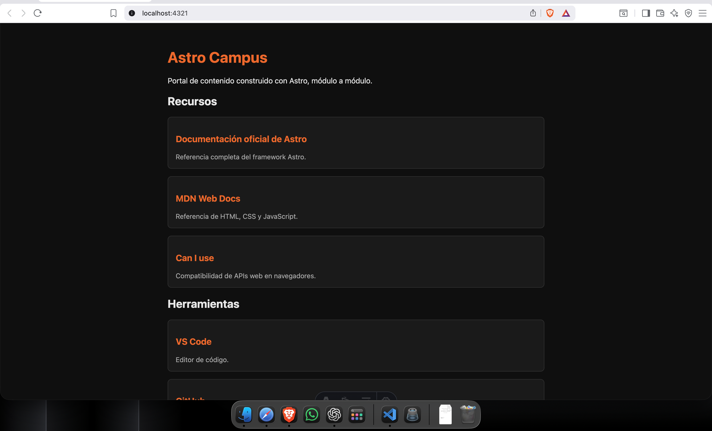
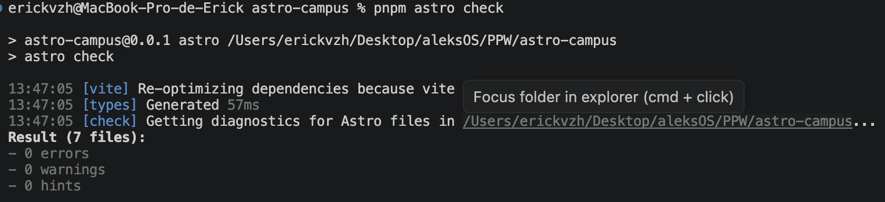
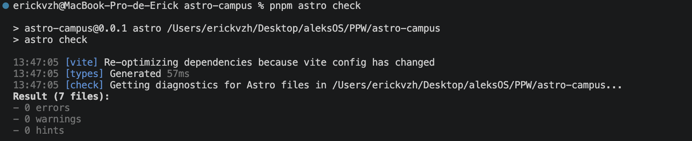

# Astro Campus

## Programación y Plataformas Web

### Astro: Desarrollo Web Moderno

## Práctica: Fundamentos de Astro

Autor: Alexander Vizhñay
Correo: evizhnayp@ups.edu.ec  
GitHub: alekspaucar

---

# Objetivo

Dominar la estructura básica de los archivos `.astro`: frontmatter, template, estilos y props.  
El proyecto `astro-campus` ahora cuenta con:

- Página principal `index.astro`
- Página secundaria `about.astro`
- Componente reutilizable `RecursoCard.astro`
- Props tipados
- Renderizado condicional
- Uso de listas dinámicas

---

# Tecnologías utilizadas

- Astro v6
- TypeScript
- pnpm
- HTML
- CSS

---

# Estructura del proyecto

```txt
astro-campus/
├── public/
│   └── favicon.svg
├── src/
│   ├── components/
│   │   └── RecursoCard.astro
│   └── pages/
│       ├── index.astro
│       └── about.astro
├── astro.config.mjs
├── package.json
├── tsconfig.json
└── pnpm-lock.yaml
```

---

# Instalación del proyecto

## Verificar versiones

```bash
node --version
pnpm --version
```

---

# Crear proyecto Astro

```bash
pnpm create astro@latest
```

Opciones utilizadas:

| Pregunta | Respuesta |
|---|---|
| Where should we create your new project? | `./astro-campus` |
| Template | `minimal` |
| Install dependencies | `Yes` |
| Git repository | `Yes` |
| TypeScript | `Yes - strict` |

---

# Ejecutar proyecto

```bash
cd astro-campus
pnpm dev
```

Abrir:

```txt
http://localhost:4321
```

---

# Verificación del proyecto

```bash
pnpm astro info
```

Resultado esperado:

```txt
Astro v6.x.x
Node v22.x.x
Package Manager pnpm
Output static
```

---

# Componente RecursoCard

Archivo:

```txt
src/components/RecursoCard.astro
```

Características:

- Props tipados
- Estilos scoped
- Links externos
- Descripción opcional

Props utilizadas:

| Prop | Tipo |
|---|---|
| titulo | string |
| url | string |
| descripcion | string opcional |

---

# Página principal

Archivo:

```txt
src/pages/index.astro
```

Características implementadas:

- Importación de componentes
- Uso de `.map()`
- Renderizado dinámico
- Lista de recursos
- Lista de herramientas
- Renderizado condicional
- Navegación hacia `/about`

---

# Página About

Archivo:

```txt
src/pages/about.astro
```

Características implementadas:

- Ruta automática `/about`
- Información del proyecto
- Información del equipo
- Renderizado condicional según entorno
- Navegación de regreso al inicio

---

# Renderizado condicional

Se utilizó:

```astro
{condicion && (...)}

{!condicion && (...)}
```

Para mostrar:

- Modo desarrollo
- Modo producción
- Validación de herramientas disponibles

---

# Validaciones completadas

- Proyecto Astro creado correctamente
- `pnpm dev` funciona sin errores
- `pnpm astro check` sin errores
- Página principal funcional
- Página `/about` funcional
- Componente reutilizable funcionando
- Props tipados funcionando
- Renderizado dinámico funcionando
- Renderizado condicional funcionando

---

# Scripts utilizados

## Desarrollo

```bash
pnpm dev
```

## Verificar TypeScript

```bash
pnpm astro check
```

## Build producción

```bash
pnpm build
```

## Preview producción

```bash
pnpm preview
```

---

# Capturas requeridas

Carpeta sugerida:

```txt
assets/
```

Capturas:

## Captura localhost



## terminal


## terminal Austro check


---

# Resultado final

El proyecto `astro-campus` quedó preparado para continuar con los siguientes módulos de Astro dentro de la materia Programación y Plataformas Web.